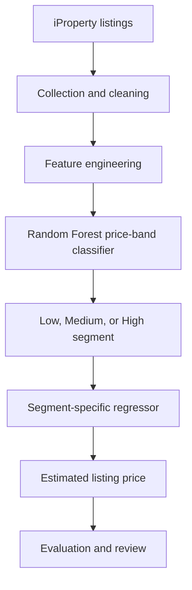

# Malaysian House Price Prediction Using Machine Learning

An end-to-end machine-learning project for analysing Malaysian residential property listings. The system uses listing attributes to classify properties into price bands and estimate a price with a regression model selected for that band.

## Business problem

Buyers, sellers, and property analysts often compare listings with different locations, sizes, property types, and facilities. Manual comparisons can be inconsistent, while a single pricing model may not represent the different patterns across lower-, mid-, and higher-priced properties.

This project explores a structured, data-driven approach to help users form an initial price estimate, compare listings, and identify properties for further review. Its outputs are estimates based on online asking listings, not formal valuations or guaranteed transaction prices.

## Solution

The main solution is a **two-stage, market-segmented prediction pipeline**:

1. A Random Forest classifier assigns a listing to the **Low**, **Medium**, or **High** price range.
2. A price-range-specific regression model estimates the listing price.

This design gives the regression models a more focused segment to learn from. The supplied project results report strong classification and segment-level regression performance; the results are shown below without combining them with the separate quartile experiment documented in the thesis.

## Dataset and collection

| Item | Description |
| --- | --- |
| Source | Residential listings from iProperty Malaysia |
| Dataset size | More than 50,000 listings, as reported in the thesis |
| Geographic scope | 13 Malaysian states and federal territories, as reported in the thesis |
| Collection period | January–March 2025 |
| Data type | Online asking listings captured during the collection period |
| Main attributes | Location, built-up area, property type, bedrooms, bathrooms, furnishing, car parks, price per square foot, and listed price |

The thesis describes automated collection with Selenium WebDriver, including dynamic-page loading, scrolling, pagination, and XPath-based extraction. The data is a market snapshot and does not represent completed transactions or subsequent price changes.

## Data preparation and features

The implementation described in the thesis combines the collected listing files, cleans price fields into numeric values, converts entries such as `4+1` into totals, and removes fields not used for modelling, including agent name and post date. It also excludes listings above **RM1,000,000** to reduce the effect of luxury-property outliers.

The project uses property attributes such as location, property type, furnishing, built-up area, bedrooms, bathrooms, and car parks. The thesis also describes engineered features including total rooms, built-up area per room, price per square foot, and log-transformed size or price values. Categorical fields are encoded for model training.

## Main model results: three price bands

### Stage 1 — Price-range classification

The Random Forest classifier predicts Low, Medium, or High price range.

| Metric | Score |
| --- | ---: |
| Accuracy | 0.9896 |
| Macro F1-score | 0.9868 |

### Stage 2 — Price estimation by segment

A separate regressor estimates price within each predicted segment.

| Price segment | Model | Test R² |
| --- | --- | ---: |
| Low | CatBoost | 0.9553 |
| Medium | Random Forest | 0.9834 |
| High | Random Forest | 0.9528 |

R² indicates how much of the variation in test-set prices is explained by each segment model. The supplied project summary does not provide MAE or RMSE in RM, a baseline comparison, or the sample count in each segment, so those details should be added when the evaluation outputs are available.

## Separate thesis experiment: four price quartiles

The thesis also reports an experiment that classifies prices into four equal-frequency quartiles, Q1–Q4, using `pandas.qcut()`. It compares Random Forest, XGBoost, LightGBM, and CatBoost using an 80:20 train-test split and random state 42.

The thesis reports approximately **98% accuracy** for Random Forest and, on encoded quartile labels, **MAE 0.0189**, **RMSE 0.1617**, and **R² 0.9790**. These are classification-label metrics, not errors in Ringgit, and they are separate from the three-band pipeline results above. The README presents the three-band system as the main solution because it produces a segment-specific price estimate, which aligns directly with the project's price-prediction use case.

## Workflow

## Business use

The pipeline could support an early-stage property comparison workflow by helping users shortlist listings, compare asking prices, and flag estimates for further review. It demonstrates how a business problem can be translated into data collection, feature preparation, model selection, evaluation, and a user-facing prototype.

The supplied project README identifies Streamlit as the interface technology. No public demo link or measured business outcome was provided, so this project is presented as a portfolio prototype rather than a production valuation service.

## Tools and skills

- **Programming and data:** Python, Pandas, NumPy
- **Data collection:** Selenium WebDriver, XPath
- **Machine learning:** Scikit-learn, Random Forest, CatBoost, XGBoost, LightGBM
- **Model tuning and evaluation:** Optuna (for regression models in the thesis), classification metrics, R², confusion matrices
- **Visualization and interface:** Matplotlib, Seaborn, Streamlit

## Limitations and next steps

- The listings are asking prices collected during **January–March 2025**, not completed transactions or current market prices; properties above **RM1,000,000** were excluded.
- The thesis describes different geographic lists and missing-value procedures across sections. The README uses the thesis's reported total of 13 states and federal territories; the final coverage and cleaning rules should be confirmed against the code and dataset.
- The thesis quartile metrics use encoded labels, while the main three-band system reports segment R². Add RM-based MAE/RMSE and compare both approaches on the same held-out listings before drawing conclusions about which performs best.
- To improve reproducibility, publish the final data dictionary, row counts before and after cleaning, confusion matrix, actual-versus-predicted examples, verified feature explanations, setup instructions, and a demo link if available.

## Project visuals

**Collected property attributes**

**Application architecture and pricing flow**

**Streamlit input flow**

## Author

**Norazlina Mohd Shariff**  
Final-Year Data Science Student
