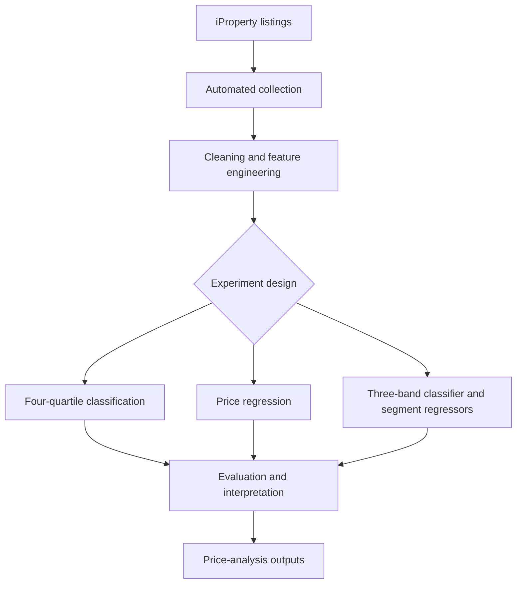

# Malaysian House Price Prediction Using Machine Learning

An end-to-end property analytics project that collects Malaysian residential listings from iProperty, prepares listing attributes, and evaluates machine-learning approaches for price estimation and price-band classification. The work explores how property characteristics such as location, built-up area, property type, and room counts can support more consistent first-pass price analysis.

> **Project status and results:** The thesis documents a quartile-classification experiment and a separate regression task. The project README draft also reports a later three-band, two-stage pipeline. These are presented separately below because their targets and results differ.

## Business problem

House prices depend on several interacting factors, including location, property type, size, furnishing, and available facilities. Manual comparisons and simple statistical approaches may not capture nonlinear relationships across a varied market. Buyers, sellers, investors, and property analysts need a consistent way to compare listings and form an initial price estimate.

This project investigates whether structured property-listing data and machine learning can help users:

- Estimate a listing's price or broad market segment from its attributes.
- Compare properties using a repeatable analytical approach.
- Identify which property characteristics are useful to examine when assessing a price.
- Explore Malaysian listing data across a broader geographic scope than a single-city study.

The model output is an analytical estimate based on listing data. It is not a formal valuation, a guaranteed sale price, or financial advice.

## Solution

The project combines web data collection, data preparation, feature engineering, model training, and evaluation. The thesis reports two experimental tasks:

1. **Price regression:** estimate a continuous property price.
2. **Price-quartile classification:** classify a listing into one of four price groups, Q1 to Q4.

The separate project README draft describes an additional **two-stage approach**: first classify a listing as Low, Medium, or High, then route it to a price-range-specific regression model. Its results are reported separately from the thesis experiment.

## Dataset

| Attribute | Description |
| --- | --- |
| Source | Residential listings collected from iProperty Malaysia |
| Dataset size | More than 50,000 listings, as reported in the thesis |
| Geographic scope | 13 Malaysian states and federal territories, as reported in the thesis |
| Collection period | January–March 2025 |
| Data type | A snapshot of online asking listings during collection; it does not represent completed transaction prices or later market changes |
| Main fields | Listing name, location, price, built-up area, property type, bedrooms, bathrooms, car parks, furnishing, and price per square foot |

The source documents describe the geographic coverage at a high level, but list locations inconsistently in different sections. The README therefore retains the thesis's stated count and does not provide a potentially inaccurate location-by-location list.

## Data collection and preparation

The thesis describes automated collection from iProperty using Selenium WebDriver, dynamic-page waits and scrolling, pagination, XPath-based extraction, and CSV outputs. It also references Selenium and Scrapy among the project tools.

Documented preparation steps include:

- Combining state-level listing files into a consolidated dataset.
- Cleaning price and price-per-square-foot text into numeric values.
- Converting entries such as `4+1` in bedroom, bathroom, or car-park fields into totals.
- Removing non-modelling fields such as agent name and post date in the implementation chapter.
- Excluding listings priced above **RM1,000,000** to reduce the influence of luxury-property outliers.
- Creating derived features such as total rooms, built-up area per room, price per square foot, and log-transformed size or price fields.
- Encoding categorical attributes such as location, furnishing, property type, and state.

The thesis describes both median/mode imputation for non-critical missing fields and removal of rows containing `N/A` values in its implementation discussion. Those are distinct preparation descriptions; the exact final cleaning configuration should be confirmed against the project code before operational reuse.

## Model design and experiments

### Experiment A — Four-quartile classification documented in the thesis

The continuous price target was divided using `pandas.qcut()` into four equal-frequency bands: Q1 (lowest 25%), Q2, Q3, and Q4 (highest 25%). The encoded class labels were used to train and compare Random Forest, XGBoost, LightGBM, and CatBoost classifiers.

- Train/test split: **80:20**.
- Random state: **42**.
- Classifier configuration: default hyperparameters, according to the thesis.
- Evaluation: accuracy, precision, recall, per-class F1, confusion matrices, and regression-style metrics computed on encoded quartile labels.
- Regression models in the thesis were tuned using Optuna; the classification models were not tuned in this experiment.

**Reported comparative result:** Chapter 5 identifies Random Forest as the strongest overall model in its quantitative comparison, reporting **MAE 0.0189**, **RMSE 0.1617**, and **R² 0.9790** on encoded quartile labels. The thesis also reports approximately **98% accuracy** for Random Forest, with F1-scores of **0.99 for Q1 and Q4** and **0.98 for Q2 and Q3**.

These MAE, RMSE, and R² values describe distances between encoded quartile labels. They are not errors measured in Malaysian ringgit and should not be interpreted as exact-price regression performance. The thesis has conflicting prose about whether CatBoost or Random Forest is the best classifier; the specific numeric comparison in Chapter 5 is used here, and should be reconciled with the final experiment outputs.

### Experiment B — Three-band, two-stage pipeline reported in the project README draft

The supplied project README describes a separate hybrid pipeline:

1. A Random Forest classifier assigns a listing to Low, Medium, or High price range.
2. A separate regression model estimates price within the selected segment.

**Classification results reported in that README draft:**

| Metric | Score |
| --- | ---: |
| Accuracy | 0.9896 |
| Macro F1-score | 0.9868 |

**Segment-specific regression results reported in that README draft:**

| Price segment | Model | Test R² |
| --- | --- | ---: |
| Low | CatBoost | 0.9553 |
| Medium | Random Forest | 0.9834 |
| High | Random Forest | 0.9528 |

These figures are kept separate from Experiment A because the README draft uses three bands and range-specific regressors, while the thesis reports four quartiles and a classifier comparison. The project materials provided do not include enough experiment artifacts to verify that both result sets use the same data split, dataset version, or evaluation protocol.

## Workflow

## Business relevance

The project demonstrates a practical analytical workflow for an early-stage property decision-support tool. Potential users could use estimated prices or price bands to shortlist listings, compare similar properties, or flag listings for further review. The segment-based design also illustrates how separate models can be evaluated for distinct parts of a market.

The project does **not** demonstrate measured business impact, automated transaction decisions, or a validated property valuation service. Listing prices may differ from actual transacted prices, and estimates should be reviewed alongside current market evidence and professional judgement.

## Tools and skills demonstrated

- **Data collection:** Python, Selenium WebDriver, XPath, Scrapy (referenced in thesis)
- **Data processing:** Pandas, NumPy, CSV workflows, missing-value and outlier handling
- **Machine learning:** Scikit-learn, Random Forest, XGBoost, LightGBM, CatBoost
- **Model tuning:** Optuna for regression-model tuning, as described in the thesis
- **Evaluation and visualization:** classification and regression metrics, confusion matrices, residual/scatter visualizations, Matplotlib, Seaborn
- **Application interface:** Streamlit is identified in the supplied project README draft; a public demo URL was not provided

## Limitations and responsible interpretation

- The data represents online asking listings collected during January–March 2025, not completed transactions or current market prices.
- The thesis describes a market snapshot and does not model temporal price changes.
- Listings above RM1,000,000 were excluded, so the reported models should not be applied to luxury properties.
- Coverage and listing availability may vary by location; the thesis gives inconsistent location lists across sections.
- The thesis describes different missing-value handling procedures in its methodology and implementation chapters.
- The quartile experiment's regression-style metrics use encoded category labels, not Ringgit prices.
- The thesis and project README draft describe different classification schemes and report different model results; results must be tied to a specific dataset, code version, and split before comparing or deploying them.
- Model explanations are mentioned in the thesis, but the supplied materials do not include SHAP plots or a final feature-importance result to show here.
- This project supports exploration and comparison; it should not replace professional valuation or current market research.

## Recommended next steps

- Publish a reproducible data dictionary and document the final cleaning rules.
- Report dataset row counts before and after each cleaning step.
- Confirm the final number and names of covered states and federal territories.
- Add a baseline and compare both model designs on the same held-out data.
- Report price-regression MAE and RMSE in RM, alongside R².
- Include a confusion matrix and per-class precision, recall, and F1 for each classifier.
- Add actual-versus-predicted examples and explain how the model should be interpreted.
- Include verified SHAP or feature-importance outputs if these analyses were completed.
- Provide reproducible setup instructions and a working Streamlit demo link if available.
- Re-evaluate the model with newer data and monitor performance as listing patterns change.

## Project visuals

**iProperty data collection and attributes**

**Streamlit application architecture and user flow**

## Author

**Norazlina Mohd Shariff**  
Final-Year Data Science Student
